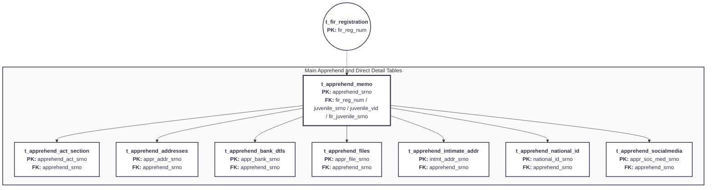
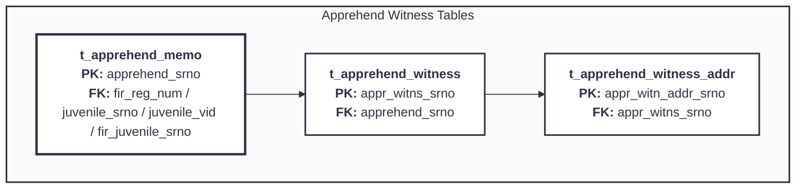
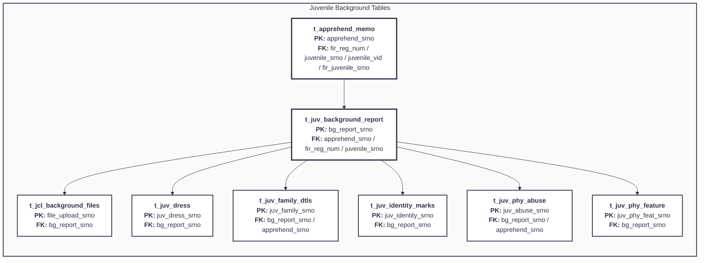

# Apprehend Module — Table Flow

## 1. Main Apprehend and Direct Details

```mermaid
flowchart TB
    FIR(("<b>t_fir_registration</b><br/><b>PK:</b> fir_reg_num"))

    subgraph DIRECT["Main Apprehend and Direct Detail Tables"]
        direction TB

        MEMO["<b>t_apprehend_memo</b><br/><b>PK:</b> apprehend_srno<br/><b>FK:</b> fir_reg_num / juvenile_srno / juvenile_vid / fir_juvenile_srno"]

        ACT["<b>t_apprehend_act_section</b><br/><b>PK:</b> apprehend_act_srno<br/><b>FK:</b> apprehend_srno"]
        ADDR["<b>t_apprehend_addresses</b><br/><b>PK:</b> appr_addr_srno<br/><b>FK:</b> apprehend_srno"]
        BANK["<b>t_apprehend_bank_dtls</b><br/><b>PK:</b> appr_bank_srno<br/><b>FK:</b> apprehend_srno"]
        FILES["<b>t_apprehend_files</b><br/><b>PK:</b> appr_file_srno<br/><b>FK:</b> apprehend_srno"]
        INTIMATE["<b>t_apprehend_intimate_addr</b><br/><b>PK:</b> intmt_addr_srno<br/><b>FK:</b> apprehend_srno"]
        NATIONAL["<b>t_apprehend_national_id</b><br/><b>PK:</b> national_id_srno<br/><b>FK:</b> apprehend_srno"]
        SOCIAL["<b>t_apprehend_socialmedia</b><br/><b>PK:</b> appr_soc_med_srno<br/><b>FK:</b> apprehend_srno"]

        MEMO --> ACT
        MEMO --> ADDR
        MEMO --> BANK
        MEMO --> FILES
        MEMO --> INTIMATE
        MEMO --> NATIONAL
        MEMO --> SOCIAL
    end

    FIR -.-> MEMO

    classDef reference fill:#ffffff,stroke:#303247,stroke-width:2px,color:#303247
    classDef main fill:#ffffff,stroke:#303247,stroke-width:3px,color:#303247
    classDef detail fill:#ffffff,stroke:#303247,stroke-width:2px,color:#303247

    class FIR reference
    class MEMO main
    class ACT,ADDR,BANK,FILES,INTIMATE,NATIONAL,SOCIAL detail
    style DIRECT fill:#fafafa,stroke:#303247,stroke-width:2px
```

## 2. Apprehend Witness Details

```mermaid
flowchart LR
    subgraph WITNESS_BRANCH["Apprehend Witness Tables"]
        direction LR

        MEMO["<b>t_apprehend_memo</b><br/><b>PK:</b> apprehend_srno<br/><b>FK:</b> fir_reg_num / juvenile_srno / juvenile_vid / fir_juvenile_srno"]

        WITNESS["<b>t_apprehend_witness</b><br/><b>PK:</b> appr_witns_srno<br/><b>FK:</b> apprehend_srno"]

        WITNESS_ADDR["<b>t_apprehend_witness_addr</b><br/><b>PK:</b> appr_witn_addr_srno<br/><b>FK:</b> appr_witns_srno"]

        MEMO --> WITNESS --> WITNESS_ADDR
    end

    classDef main fill:#ffffff,stroke:#303247,stroke-width:3px,color:#303247
    classDef detail fill:#ffffff,stroke:#303247,stroke-width:2px,color:#303247

    class MEMO main
    class WITNESS,WITNESS_ADDR detail
    style WITNESS_BRANCH fill:#fafafa,stroke:#303247,stroke-width:2px
```

## 3. Juvenile Background Details

```mermaid
flowchart TB
    subgraph BACKGROUND["Juvenile Background Tables"]
        direction TB

        MEMO["<b>t_apprehend_memo</b><br/><b>PK:</b> apprehend_srno<br/><b>FK:</b> fir_reg_num / juvenile_srno / juvenile_vid / fir_juvenile_srno"]

        REPORT["<b>t_juv_background_report</b><br/><b>PK:</b> bg_report_srno<br/><b>FK:</b> apprehend_srno / fir_reg_num / juvenile_srno"]

        BG_FILES["<b>t_jcl_background_files</b><br/><b>PK:</b> file_upload_srno<br/><b>FK:</b> bg_report_srno"]
        DRESS["<b>t_juv_dress</b><br/><b>PK:</b> juv_dress_srno<br/><b>FK:</b> bg_report_srno"]
        FAMILY["<b>t_juv_family_dtls</b><br/><b>PK:</b> juv_family_srno<br/><b>FK:</b> bg_report_srno / apprehend_srno"]
        ID_MARKS["<b>t_juv_identity_marks</b><br/><b>PK:</b> juv_identity_srno<br/><b>FK:</b> bg_report_srno"]
        ABUSE["<b>t_juv_phy_abuse</b><br/><b>PK:</b> juv_abuse_srno<br/><b>FK:</b> bg_report_srno / apprehend_srno"]
        FEATURES["<b>t_juv_phy_feature</b><br/><b>PK:</b> juv_phy_feat_srno<br/><b>FK:</b> bg_report_srno"]

        MEMO --> REPORT
        REPORT --> BG_FILES
        REPORT --> DRESS
        REPORT --> FAMILY
        REPORT --> ID_MARKS
        REPORT --> ABUSE
        REPORT --> FEATURES
    end

    classDef main fill:#ffffff,stroke:#303247,stroke-width:3px,color:#303247
    classDef detail fill:#ffffff,stroke:#303247,stroke-width:2px,color:#303247

    class MEMO,REPORT main
    class BG_FILES,DRESS,FAMILY,ID_MARKS,ABUSE,FEATURES detail
    style BACKGROUND fill:#fafafa,stroke:#303247,stroke-width:2px
```
