# Arrest Module — Table Flow

Source workbook: `CCTNS_Modules_Search&View_Figma_26052026_V2.xlsx`

Filter used: `module_wise_json_postgres.complaint_type = arrest`

The filter returns **15 Arrest module tables**.

## Flow Chart With PK/FK

```mermaid
flowchart TB
    FIR(("<b>t_fir_registration</b><br/><b>PK:</b> fir_reg_num<br/>FIR reference only"))
    ACC(("<b>t_fir_accused_info</b><br/><b>PK:</b> accused_vid<br/>Accused reference only"))

    subgraph ARREST["Arrest Module Tables"]
        direction TB

        MEMO["<b>t_arrest_memo</b><br/><b>PK:</b> arr_surr_srno<br/><b>FK:</b> fir_reg_num / accused_vid / accused_srno"]

        subgraph DIRECT["Direct Arrest Details"]
            direction LR
            ACT["<b>t_arrest_act_section</b><br/><b>PK:</b> arrest_act_srno<br/><b>FK:</b> arr_surr_srno"]
            ADDR["<b>t_arrest_addresses</b><br/><b>PK:</b> arr_addr_srno<br/><b>FK:</b> arr_surr_srno"]
            BANK["<b>t_arrest_bank_dtls</b><br/><b>PK:</b> arr_bank_srno<br/><b>FK:</b> arr_surr_srno"]
            DRESS["<b>t_arrest_dress</b><br/><b>PK:</b> arr_dress_srno<br/><b>FK:</b> arr_surr_srno"]
            FILES["<b>t_arrest_files</b><br/><b>PK:</b> arr_file_srno<br/><b>FK:</b> arr_surr_srno"]
            MARKS["<b>t_arrest_identity_marks</b><br/><b>PK:</b> arr_identity_srno<br/><b>FK:</b> arr_surr_srno"]
            INTIMATE["<b>t_arrest_intimate_addr</b><br/><b>PK:</b> intmt_addr_srno<br/><b>FK:</b> arr_surr_srno"]
            MED["<b>t_arrest_med_exam</b><br/><b>PK:</b> arr_med_exam_srno<br/><b>FK:</b> arr_surr_srno"]
            NATIONAL["<b>t_arrest_national_id</b><br/><b>PK:</b> national_id_srno<br/><b>FK:</b> arr_surr_srno"]
            PHY["<b>t_arrest_phy_feature</b><br/><b>PK:</b> arr_phy_feat_srno<br/><b>FK:</b> arr_surr_srno"]
        end

        subgraph WITNESS_BRANCH["Witness Branch"]
            direction LR
            WITNESS["<b>t_arrest_witness</b><br/><b>PK:</b> arr_witns_srno<br/><b>FK:</b> arr_surr_srno"]
            WITNESS_ADDR["<b>t_arrest_witness_addr</b><br/><b>PK:</b> arr_witn_addr_srno<br/><b>FK:</b> arr_witns_srno"]
            WITNESS -->|"arr_witns_srno"| WITNESS_ADDR
        end

        subgraph SEARCH_BRANCH["Person Search Branch"]
            direction LR
            SEARCH_PROP["<b>t_person_search_property</b><br/><b>PK:</b> prop_srno<br/><b>FK:</b> arr_surr_srno"]
            SEARCH_ITEMS["<b>t_person_search_items</b><br/><b>PK:</b> prop_item_srno<br/><b>FK:</b> prop_srno"]
            SEARCH_PROP -->|"prop_srno"| SEARCH_ITEMS
        end

        MEMO -->|"arr_surr_srno"| ACT
        MEMO -->|"arr_surr_srno"| ADDR
        MEMO -->|"arr_surr_srno"| BANK
        MEMO -->|"arr_surr_srno"| DRESS
        MEMO -->|"arr_surr_srno"| FILES
        MEMO -->|"arr_surr_srno"| MARKS
        MEMO -->|"arr_surr_srno"| INTIMATE
        MEMO -->|"arr_surr_srno"| MED
        MEMO -->|"arr_surr_srno"| NATIONAL
        MEMO -->|"arr_surr_srno"| PHY
        MEMO -->|"arr_surr_srno"| WITNESS
        MEMO -->|"arr_surr_srno"| SEARCH_PROP
    end

    FIR -.->|"fir_reg_num"| MEMO
    ACC -.->|"accused_vid; accused_srno as context"| MEMO

    classDef reference fill:#ffffff,stroke:#303247,stroke-width:2px,color:#303247
    classDef root fill:#eef6ff,stroke:#2563eb,stroke-width:3px,color:#111827
    classDef detail fill:#f8fafc,stroke:#64748b,stroke-width:2px,color:#111827
    classDef witness fill:#fff7ed,stroke:#ea580c,stroke-width:2px,color:#111827
    classDef search fill:#f0fdf4,stroke:#16a34a,stroke-width:2px,color:#111827

    class FIR,ACC reference
    class MEMO root
    class ACT,ADDR,BANK,DRESS,FILES,MARKS,INTIMATE,MED,NATIONAL,PHY detail
    class WITNESS,WITNESS_ADDR witness
    class SEARCH_PROP,SEARCH_ITEMS search

    style ARREST fill:#fafafa,stroke:#303247,stroke-width:2px
    style DIRECT fill:#ffffff,stroke:#94a3b8,stroke-width:1px
    style WITNESS_BRANCH fill:#fffaf5,stroke:#fdba74,stroke-width:1px
    style SEARCH_BRANCH fill:#f7fff9,stroke:#86efac,stroke-width:1px
```

## Tables Detected

| Table | Columns in JSON | Parent | Link to parent | Role |
|---|---:|---|---|---|
| `t_arrest_memo` | 176 | FIR / Accused references | `fir_reg_num`, `accused_vid`, `accused_srno` | Root arrest or surrender record |
| `t_arrest_act_section` | 13 | `t_arrest_memo` | `arr_surr_srno` | Acts and sections applied to the arrest |
| `t_arrest_addresses` | 31 | `t_arrest_memo` | `arr_surr_srno` | Arrested person's addresses |
| `t_arrest_bank_dtls` | 13 | `t_arrest_memo` | `arr_surr_srno` | Bank/account details |
| `t_arrest_dress` | 17 | `t_arrest_memo` | `arr_surr_srno` | Dress and appearance details |
| `t_arrest_files` | 21 | `t_arrest_memo` | `arr_surr_srno` | Arrest documents and uploaded evidence |
| `t_arrest_identity_marks` | 15 | `t_arrest_memo` | `arr_surr_srno` | Identification marks and tattoos |
| `t_arrest_intimate_addr` | 28 | `t_arrest_memo` | `arr_surr_srno` | Address of the informed relative/person |
| `t_arrest_med_exam` | 16 | `t_arrest_memo` | `arr_surr_srno` | Medical examination details |
| `t_arrest_national_id` | 15 | `t_arrest_memo` | `arr_surr_srno` | National identity and passport details |
| `t_arrest_phy_feature` | 19 | `t_arrest_memo` | `arr_surr_srno` | Physical features |
| `t_arrest_witness` | 41 | `t_arrest_memo` | `arr_surr_srno` | Arrest witness details and statement |
| `t_arrest_witness_addr` | 29 | `t_arrest_witness` | `arr_witns_srno` | Witness addresses |
| `t_person_search_property` | 16 | `t_arrest_memo` | `arr_surr_srno` | Person-search event and property summary |
| `t_person_search_items` | 13 | `t_person_search_property` | `prop_srno` | Individual items found during the search |

## Relationship Notes

- `t_arrest_memo` is the Arrest module root, identified by `arr_surr_srno`.
- Twelve module tables link directly to the root through `arr_surr_srno`.
- `t_arrest_witness_addr` is a second-level child of `t_arrest_witness` through `arr_witns_srno`.
- `t_person_search_items` is a second-level child of `t_person_search_property` through `prop_srno`.
- `t_fir_registration` and `t_fir_accused_info` are shown only as shared references. They are not included in the 15 rows returned by the Arrest filter.
- `accused_vid` identifies the referenced accused profile row. `accused_srno` and `fir_reg_num` provide accused/FIR context and fallback linkage.
- `t_arrest_addresses` and `t_arrest_phy_feature` also contain accused identifiers, but their direct Arrest ownership link is `arr_surr_srno`.
- PK/FK roles are inferred from repeated key columns in the workbook JSON. The workbook does not expose PostgreSQL constraint metadata.
