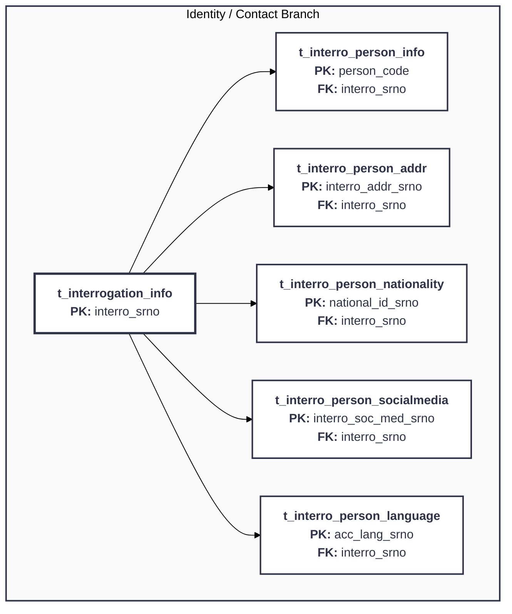
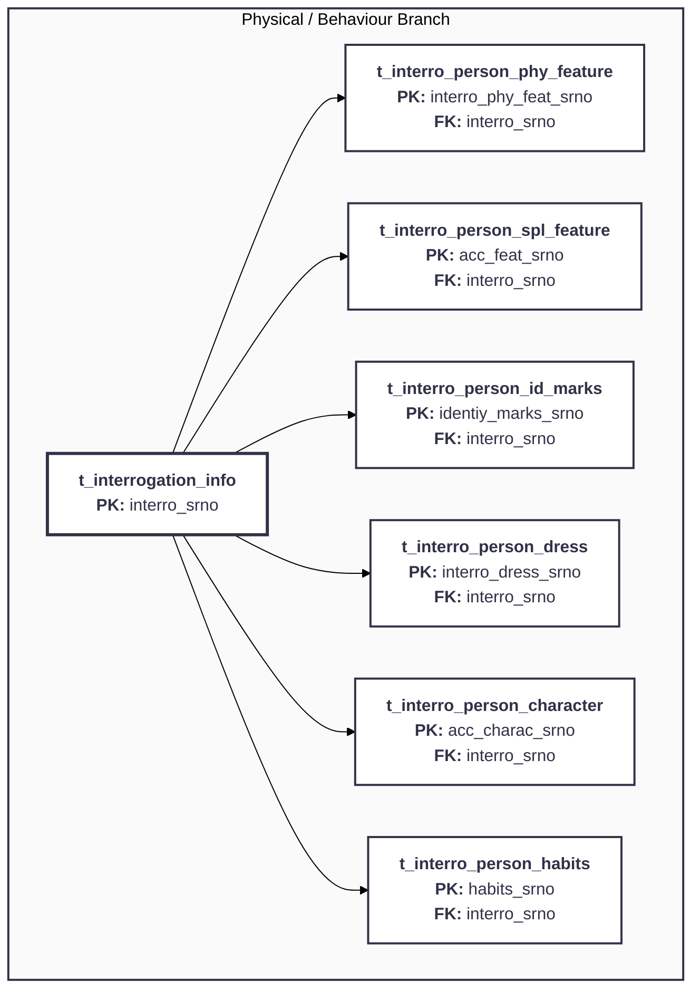
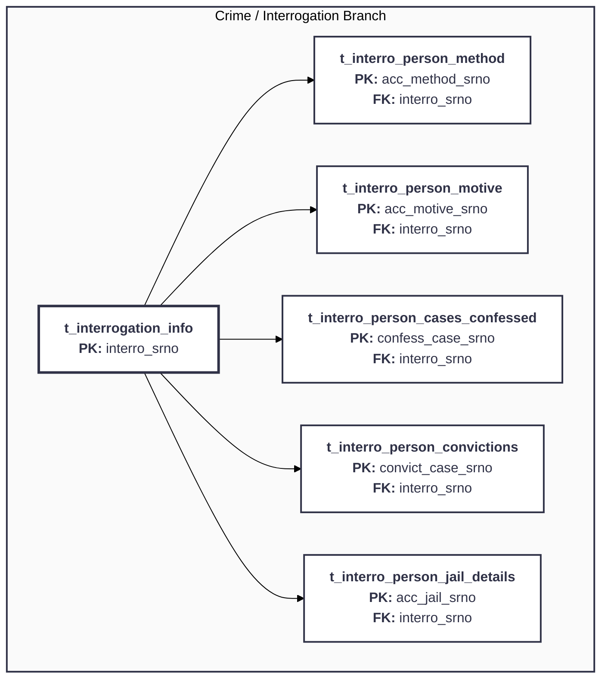
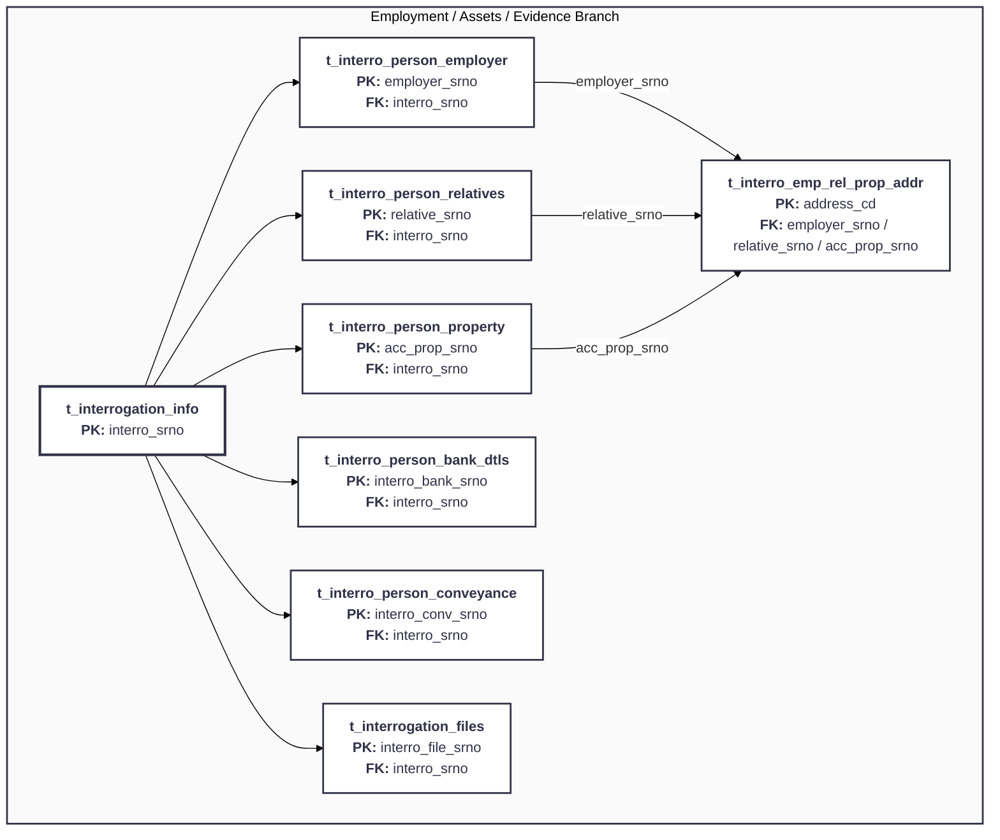

# Interro Module — Mermaid Table Flow

Source workbook: `CCTNS_Modules_Search&View_Figma_26052026_V2 (1).xlsx`

Filter used: `module_wise_json_postgres.complaint_type = interro`

The filter returns **24 Interro module tables**. The diagrams follow the same plain Mermaid table-flow style used by `Accused/accused_flow_chart_images`.

## 1. Interro Profile Root

```mermaid
%%{init: {'theme':'base','themeVariables':{'primaryColor':'#ffffff','primaryBorderColor':'#303247','lineColor':'#000000','fontFamily':'Arial','clusterBkg':'#fafafa','clusterBorder':'#303247'}}}%%
flowchart LR
    FIR(("<b>t_fir_registration</b><br/><b>PK:</b> fir_reg_num<br/>FIR reference only"))
    ACC(("<b>t_fir_accused_info</b><br/><b>PK:</b> accused_vid<br/>Accused reference only"))

    subgraph INTERRO_ROOT["Interro Profile Root"]
        direction LR

        ROOT["<b>t_interrogation_info</b><br/><b>PK:</b> interro_srno<br/><b>FK:</b> fir_reg_num / accused_srno / accused_vid"]

        subgraph IDENTITY["Identity / Contact Branch"]
            direction TB
            PERSON["<b>t_interro_person_info</b><br/><b>PK:</b> person_code<br/><b>FK:</b> interro_srno"]
            PERSON_ADDR["<b>t_interro_person_addr</b><br/><b>PK:</b> interro_addr_srno<br/><b>FK:</b> interro_srno"]
            NATIONALITY["<b>t_interro_person_nationality</b><br/><b>PK:</b> national_id_srno<br/><b>FK:</b> interro_srno"]
            SOCIAL["<b>t_interro_person_socialmedia</b><br/><b>PK:</b> interro_soc_med_srno<br/><b>FK:</b> interro_srno"]
            LANGUAGE["<b>t_interro_person_language</b><br/><b>PK:</b> acc_lang_srno<br/><b>FK:</b> interro_srno"]
        end

        subgraph PHYSICAL["Physical / Behaviour Branch"]
            direction TB
            PHY["<b>t_interro_person_phy_feature</b><br/><b>PK:</b> interro_phy_feat_srno<br/><b>FK:</b> interro_srno"]
            SPECIAL["<b>t_interro_person_spl_feature</b><br/><b>PK:</b> acc_feat_srno<br/><b>FK:</b> interro_srno"]
            MARKS["<b>t_interro_person_id_marks</b><br/><b>PK:</b> identiy_marks_srno<br/><b>FK:</b> interro_srno"]
            DRESS["<b>t_interro_person_dress</b><br/><b>PK:</b> interro_dress_srno<br/><b>FK:</b> interro_srno"]
            CHARACTER["<b>t_interro_person_character</b><br/><b>PK:</b> acc_charac_srno<br/><b>FK:</b> interro_srno"]
            HABITS["<b>t_interro_person_habits</b><br/><b>PK:</b> habits_srno<br/><b>FK:</b> interro_srno"]
        end

        subgraph CRIME["Crime / Interrogation Branch"]
            direction TB
            METHOD["<b>t_interro_person_method</b><br/><b>PK:</b> acc_method_srno<br/><b>FK:</b> interro_srno"]
            MOTIVE["<b>t_interro_person_motive</b><br/><b>PK:</b> acc_motive_srno<br/><b>FK:</b> interro_srno"]
            CONFESSED["<b>t_interro_person_cases_confessed</b><br/><b>PK:</b> confess_case_srno<br/><b>FK:</b> interro_srno"]
            CONVICTIONS["<b>t_interro_person_convictions</b><br/><b>PK:</b> convict_case_srno<br/><b>FK:</b> interro_srno"]
            JAIL["<b>t_interro_person_jail_details</b><br/><b>PK:</b> acc_jail_srno<br/><b>FK:</b> interro_srno"]
        end

        subgraph ASSETS["Employment / Assets / Evidence Branch"]
            direction TB
            EMPLOYER["<b>t_interro_person_employer</b><br/><b>PK:</b> employer_srno<br/><b>FK:</b> interro_srno"]
            RELATIVES["<b>t_interro_person_relatives</b><br/><b>PK:</b> relative_srno<br/><b>FK:</b> interro_srno"]
            PROPERTY["<b>t_interro_person_property</b><br/><b>PK:</b> acc_prop_srno<br/><b>FK:</b> interro_srno"]
            BANK["<b>t_interro_person_bank_dtls</b><br/><b>PK:</b> interro_bank_srno<br/><b>FK:</b> interro_srno"]
            CONVEYANCE["<b>t_interro_person_conveyance</b><br/><b>PK:</b> interro_conv_srno<br/><b>FK:</b> interro_srno"]
            FILES["<b>t_interrogation_files</b><br/><b>PK:</b> interro_file_srno<br/><b>FK:</b> interro_srno"]
            SHARED_ADDR["<b>t_interro_emp_rel_prop_addr</b><br/><b>PK:</b> address_cd<br/><b>FK:</b> employer_srno / relative_srno / acc_prop_srno"]
        end

        ROOT --> PERSON
        ROOT --> PERSON_ADDR
        ROOT --> NATIONALITY
        ROOT --> SOCIAL
        ROOT --> LANGUAGE

        ROOT --> PHY
        ROOT --> SPECIAL
        ROOT --> MARKS
        ROOT --> DRESS
        ROOT --> CHARACTER
        ROOT --> HABITS

        ROOT --> METHOD
        ROOT --> MOTIVE
        ROOT --> CONFESSED
        ROOT --> CONVICTIONS
        ROOT --> JAIL

        ROOT --> EMPLOYER
        ROOT --> RELATIVES
        ROOT --> PROPERTY
        ROOT --> BANK
        ROOT --> CONVEYANCE
        ROOT --> FILES

        EMPLOYER --> SHARED_ADDR
        RELATIVES --> SHARED_ADDR
        PROPERTY --> SHARED_ADDR
    end

    FIR -.-> ROOT
    ACC -.-> ROOT

    classDef reference fill:#ffffff,stroke:#303247,stroke-width:2px,color:#303247
    classDef main fill:#ffffff,stroke:#303247,stroke-width:3px,color:#303247
    classDef detail fill:#ffffff,stroke:#303247,stroke-width:2px,color:#303247

    class FIR,ACC reference
    class ROOT main
    class PERSON,PERSON_ADDR,NATIONALITY,SOCIAL,LANGUAGE,PHY,SPECIAL,MARKS,DRESS,CHARACTER,HABITS,METHOD,MOTIVE,CONFESSED,CONVICTIONS,JAIL,EMPLOYER,RELATIVES,PROPERTY,BANK,CONVEYANCE,FILES,SHARED_ADDR detail

    style INTERRO_ROOT fill:#fafafa,stroke:#303247,stroke-width:2px
    style IDENTITY fill:#fafafa,stroke:#303247,stroke-width:1px
    style PHYSICAL fill:#fafafa,stroke:#303247,stroke-width:1px
    style CRIME fill:#fafafa,stroke:#303247,stroke-width:1px
    style ASSETS fill:#fafafa,stroke:#303247,stroke-width:1px
```

## 2. Identity / Contact Branch

## 3. Physical / Behaviour Branch

## 4. Crime / Interrogation Branch

## 5. Employment / Assets / Evidence Branch

## How to read it

- Rectangular nodes are tables returned by the `interro` filter.
- `t_interrogation_info` is the root table and is identified by `interro_srno`.
- Solid arrows show module parent-to-child relationships.
- Circular nodes are shared FIR/Accused references; dotted arrows indicate reference-only links.
- Twenty-two tables connect directly to `t_interrogation_info` through `interro_srno`.
- `t_interro_emp_rel_prop_addr` is the only second-level table. It can connect through `employer_srno`, `relative_srno`, or `acc_prop_srno`.
- PK/FK roles are inferred from repeated key names in the workbook JSON. PostgreSQL constraint metadata was not included in the sheet.

