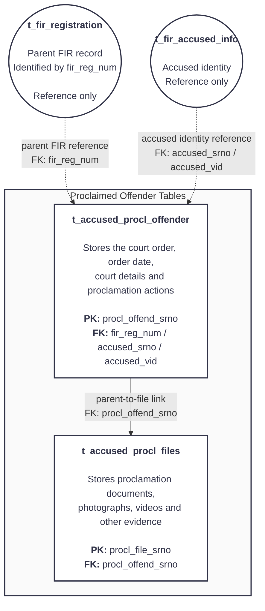

# Proclaimed Offender Module — Order and Evidence

## How to read it

- Only the two rectangular tables inside the boundary belong to Proclaimed Offender ingestion.
- The circular tables are shared references owned by the FIR and Accused modules.
- Dotted lines mean lookup/reference only; they are not additional ingestion tables.
- The solid line is the module's main parent-to-evidence flow, ending at `t_accused_procl_files`.
- `t_fir_registration` supplies the parent FIR identified by `fir_reg_num`. It does not mean that FIR number and year are separate foreign keys in this flow.
- **PK** identifies a row within its own table; **FK** connects that row to its parent/reference table.
