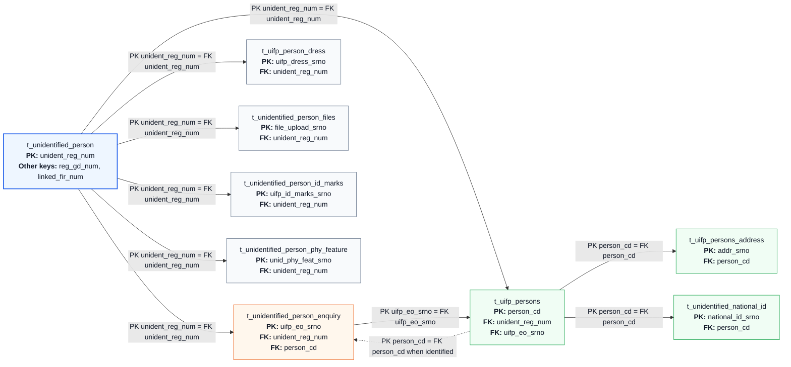
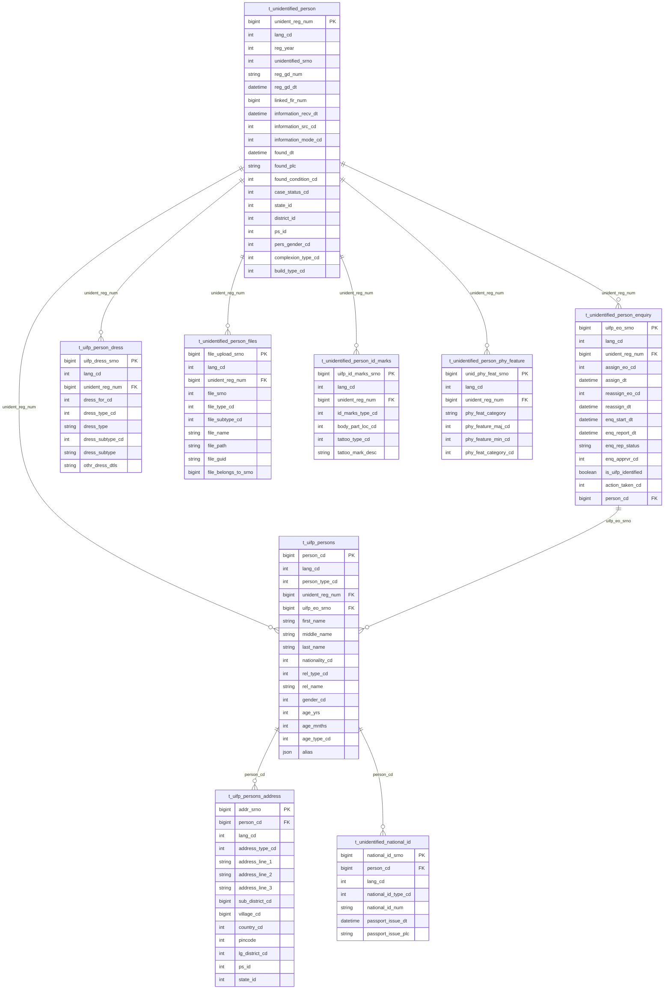

# UIFP Module Table Diagram

Source workbook: `CCTNS_Modules_Search&View_Figma_26052026_V2 (1).xlsx`

Filter used: `module_wise_json_postgres.complaint_type = uifp`

The `MODULES` sheet lists this module as `UIFP(unidentified Person)`.

## Flow Chart With PK/FK

## ER Diagram

## Tables Detected

| Table | Columns | Main Role |
|---|---:|---|
| `t_unidentified_person` | 71 | Root UIFP registration/case table |
| `t_unidentified_person_enquiry` | 44 | Enquiry assignment/report/closure details |
| `t_uifp_persons` | 39 | Identified/associated person details |
| `t_uifp_persons_address` | 28 | Address details for `t_uifp_persons` |
| `t_unidentified_national_id` | 15 | National ID details for `t_uifp_persons` |
| `t_uifp_person_dress` | 18 | Dress/apparel details linked to the UIFP registration |
| `t_unidentified_person_files` | 21 | Uploaded files linked to the UIFP registration |
| `t_unidentified_person_id_marks` | 15 | Identification marks linked to the UIFP registration |
| `t_unidentified_person_phy_feature` | 17 | Physical features linked to the UIFP registration |

## Relationship Notes

- `t_unidentified_person` is the root table by `unident_reg_num`.
- Most supporting tables carry `unident_reg_num`, so they attach directly to the root UIFP case.
- `t_uifp_persons` also carries `uifp_eo_srno`, so it can be tied to an enquiry row.
- `t_uifp_persons_address` and `t_unidentified_national_id` attach through `person_cd`.
- These relationships are inferred from shared key column names in the JSON sheet; the workbook does not expose database FK constraints directly.
